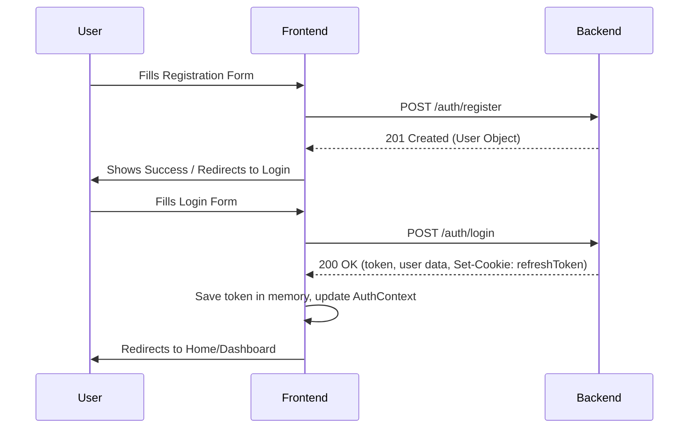
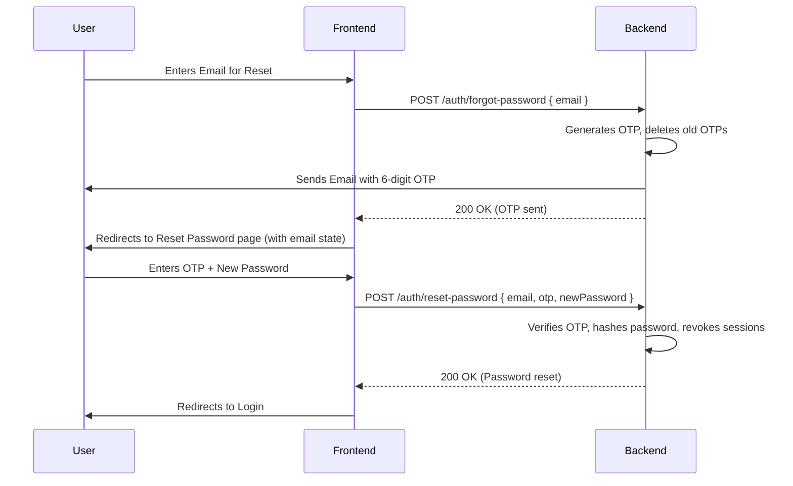
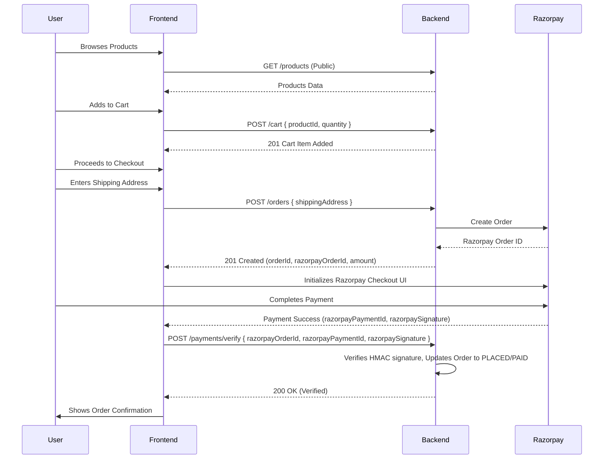
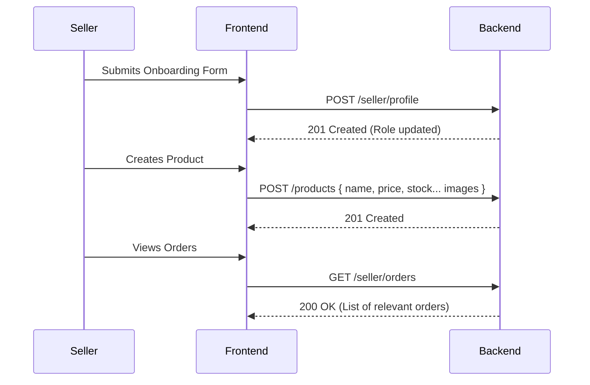

# Sellora Application Reference

This document serves as the single source of truth for the Sellora platform, reflecting the actual implementation of the backend and guiding the frontend development. It supersedes previous assumptions about backend capabilities and API flows.

---

## 1. API Reference

All endpoints are prefixed with `/api`.

### Health
- **`GET /health`**
  - **Auth:** Public
  - **Description:** Checks API health.
  - **Response:** 200 OK `{ success: true, statusCode: 200, message: "API is running", data: {} }`

### Authentication
- **`POST /auth/register`**
  - **Auth:** Public
  - **Request Body:** `name`, `email`, `password`, `mobileNumber`
  - **Response (201):** User object `{ id, name, email, role }`
  - **Errors:** 400 Validation Error, 409 Email already registered

- **`POST /auth/login`**
  - **Auth:** Public
  - **Request Body:** `email`, `password`
  - **Response (200):** `{ token, user: { id, name, email, role } }`. Also sets `refreshToken` in HTTP-only cookie.
  - **Errors:** 400 Validation, 401 Invalid credentials, 429 Too many attempts

- **`POST /auth/refresh-token`**
  - **Auth:** Refresh token via HTTP-only cookie
  - **Response (200):** `{ token }`. Also rotates the `refreshToken` cookie.
  - **Errors:** 401 Unauthorized/Expired

- **`POST /auth/logout`**
  - **Auth:** Refresh token via HTTP-only cookie
  - **Response (200):** Success (clears cookie)

- **`GET /auth/sessions`**
  - **Auth:** Requires Token
  - **Response (200):** Array of active sessions `{ id, deviceInfo, ipAddress, createdAt, lastUsedAt, expiresAt }`

- **`POST /auth/logout-all`**
  - **Auth:** Requires Token
  - **Response (200):** Success (clears cookie, revokes all sessions)

- **`GET /auth/me`**
  - **Auth:** Requires Token
  - **Response (200):** User object `{ id, name, email, role }`

- **`POST /auth/forgot-password`**
  - **Auth:** Public
  - **Request Body:** `email`
  - **Behavior:** Generates a 6-digit OTP and sends it via email. Valid for 10 minutes.
  - **Response (200):** Success message

- **`POST /auth/reset-password`**
  - **Auth:** Public
  - **Request Body:** `email`, `otp` (6 digits), `newPassword` (min 8 chars, mixed case, numbers, special)
  - **Behavior:** Validates OTP, updates password, revokes all existing refresh tokens.
  - **Response (200):** Success message
  - **Errors:** 400 Invalid OTP, 404 User not found

- **`PUT /auth/change-password`**
  - **Auth:** Requires Token
  - **Request Body:** `oldPassword`, `newPassword`
  - **Response (200):** Success message

### Seller
- **`POST /seller/profile`**
  - **Auth:** Requires Token
  - **Request Body:** `storeName`, `gstNumber`, `panNumber`, `address`, `description` (optional), `logo` (optional)
  - **Response (201):** Seller profile object. Promotes user to seller role.

- **`GET /seller/profile`**
  - **Auth:** Requires Seller Role
  - **Response (200):** Seller profile object

- **`PUT /seller/profile`**
  - **Auth:** Requires Seller Role
  - **Request Body:** Same as POST
  - **Response (200):** Updated seller profile

- **`GET /seller/orders`**
  - **Auth:** Requires Seller Role
  - **Response (200):** Array of orders containing products owned by the seller `{ orderId, totalAmount, orderStatus, paymentStatus, customerName, items: [...] }`

### Categories
- **`POST /categories`**
  - **Auth:** Requires Admin Role
  - **Request Body:** `name`, `description`
  - **Response (201):** Category object

- **`GET /categories`**
  - **Auth:** Public
  - **Response (200):** Array of all categories

- **`GET /categories/{id}`**
  - **Auth:** Public
  - **Response (200):** Category object

- **`PUT /categories/{id}`**
  - **Auth:** Requires Admin Role
  - **Request Body:** `name`, `description`
  - **Response (200):** Updated Category object

### Products
- **`POST /products`**
  - **Auth:** Requires Seller Role
  - **Request Body:** `name`, `description`, `price`, `stock`, `categoryId`, `images` (array of `{ url, displayOrder }`)
  - **Response (201):** Product object

- **`GET /products`**
  - **Auth:** Public
  - **Query Params:** `page`, `limit`, `search`, `categoryId`, `sort`
  - **Response (200):** `{ products: [...], pagination: {...} }`

- **`GET /products/{id}`**
  - **Auth:** Public
  - **Response (200):** Product object

- **`PUT /products/{id}`**
  - **Auth:** Requires Seller Role
  - **Request Body:** Same as POST
  - **Response (200):** Updated product

- **`DELETE /products/{id}`**
  - **Auth:** Requires Seller Role
  - **Response (200):** Success (soft delete)

### Cart
- **`POST /cart`**
  - **Auth:** Requires Token
  - **Request Body:** `productId`, `quantity`
  - **Response (201):** Cart item object

- **`GET /cart`**
  - **Auth:** Requires Token
  - **Response (200):** Array of cart items `{ id, cartId, productId, productName, price, image_url, quantity, subtotal }`

- **`PUT /cart/{id}`**
  - **Auth:** Requires Token
  - **Request Body:** `quantity`
  - **Response (200):** Updated cart item

- **`DELETE /cart/{id}`**
  - **Auth:** Requires Token
  - **Response (200):** Success

### Orders & Checkout
- **`POST /orders`**
  - **Auth:** Requires Token
  - **Request Body:** `shippingAddress` `{ name, address, city, state, pincode, phone }`
  - **Behavior:** Validates cart and stock, creates DB order (PENDING), creates Razorpay order, clears cart.
  - **Response (201):** `{ orderId, totalAmount, status, paymentStatus, razorpayOrderId, razorpayKeyId, amount, currency }`

- **`GET /orders`**
  - **Auth:** Requires Token
  - **Response (200):** Array of user's orders

- **`GET /orders/{id}`**
  - **Auth:** Requires Token
  - **Response (200):** Detailed order object

### Payments
- **`POST /payments/verify`**
  - **Auth:** Requires Token
  - **Request Body:** `razorpayOrderId`, `razorpayPaymentId`, `razorpaySignature`
  - **Behavior:** Verifies HMAC signature. If valid, marks order payment_status as PAID and status as PLACED.
  - **Response (200):** `{ orderId, paymentStatus: 'PAID', orderStatus: 'PLACED' }`

### Admin
- **`GET /admin/orders`**
  - **Auth:** Requires Admin Role
  - **Response (200):** Array of all orders

- **`PUT /admin/orders/{id}/status`**
  - **Auth:** Requires Admin Role
  - **Request Body:** `status` (PENDING, PLACED, PROCESSING, SHIPPED, DELIVERED, CANCELLED)
  - **Response (200):** `{ orderId, oldStatus, newStatus }`

---

## 2. App Flow Diagrams

### Registration → Login

### Forgot Password → OTP → Reset

### Browse → Cart → Checkout → Payment

### Seller Flow

---

## 3. Updated PRD

**Core Corrections from Previous Assumptions:**
- **Categories:** `GET /categories` is PUBLIC. Category browsing is fully supported.
- **Seller Orders:** `GET /seller/orders` EXISTS. Sellers can view orders containing their products.
- **Address Handling:** Checkout properly accepts a `shippingAddress` object. Address entry at checkout is fully supported.
- **Payment Verification:** `POST /payments/verify` EXISTS. The full end-to-end Razorpay flow is fully supported.
- **Product Images:** Products support an array of images. Product galleries are fully supported.

**Success Criteria Update:**
The backend is fully feature-complete for v1. No mock data or stubbing is required for any of the core storefront, checkout, or seller flows.

---

## 4. Updated TRD

**Core Corrections from Previous Assumptions:**
- **Token Storage:** The backend explicitly sets the refresh token in an HTTP-only cookie (`Set-Cookie: refreshToken`). The frontend must store the access token in memory/state and rely on `withCredentials: true` for axios to send the refresh token to `/auth/refresh-token`.
- **Checkout Flow:** The checkout process is a two-step API flow:
  1. `POST /orders` -> returns Razorpay order details.
  2. Razorpay UI -> returns payment/signature IDs.
  3. `POST /payments/verify` -> finalizes the order in the database.
- **Forgot Password Flow:** This is an OTP flow, not a link flow. Frontend must collect the 6-digit OTP alongside the new password in the Reset Password page.

---

## 5. Design Cross-Reference (Stitch Pages to APIs)

| Stitch Page | Corresponding API Endpoints | Form Field Checks |
|---|---|---|
| **Home** | `GET /products` (featured), `GET /categories` | N/A |
| **Product Listing** | `GET /products`, `GET /categories` | N/A |
| **Product Detail** | `GET /products/{id}`, `POST /cart` | N/A |
| **Cart** | `GET /cart`, `PUT /cart/{id}`, `DELETE /cart/{id}` | N/A |
| **Checkout** | `POST /orders`, `POST /payments/verify` | Needs shipping address fields (name, address, city, state, pincode, phone). |
| **Order Success** | N/A (Client-side view) | N/A |
| **Order History** | `GET /orders` | N/A |
| **Order Detail** | `GET /orders/{id}` | N/A |
| **User Profile** | `GET /auth/me`, `PUT /auth/change-password` | Change password requires old and new password fields. |
| **Login** | `POST /auth/login` | Email, Password. |
| **Register** | `POST /auth/register` | Needs `name` (not fullName), `mobileNumber` (not mobile). The backend does NOT accept `role` here; seller roles are established later via `POST /seller/profile`. |
| **Forgot Password** | `POST /auth/forgot-password` | Email. |
| **Reset Password** | `POST /auth/reset-password` | Email, OTP (6 digits), New Password. |
| **Seller Dashboard** | `GET /seller/profile`, `GET /seller/orders` | N/A |
| **Seller Products** | `GET /products` (filtered by seller context) | N/A |
| **Seller Add Product** | `POST /products` | Needs name, desc, price, stock, categoryId, images array. |
| **Admin Categories** | `GET /categories`, `POST /categories`, `PUT /categories/{id}` | Name, description. |
| **Admin Orders** | `GET /admin/orders`, `PUT /admin/orders/{id}/status` | Status dropdown (PENDING, PLACED, PROCESSING, SHIPPED, DELIVERED, CANCELLED). |
